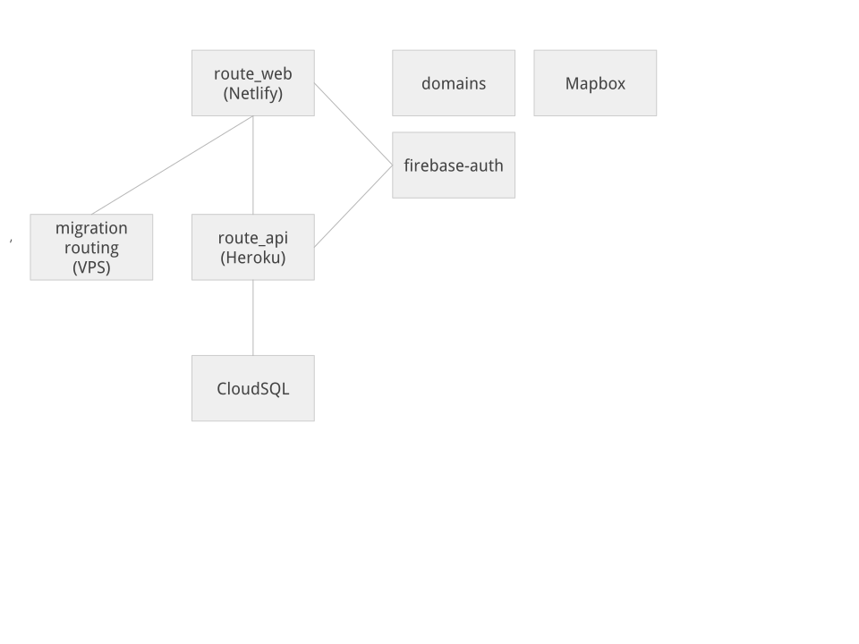

# ルートハブ(RouteHub)


[](https://app.netlify.com/sites/tender-archimedes-e0e6a1/deploys)


## ルートハブとは
手軽なルート共有・作成サイトです。

2019年にルートラボのクローズの告知をうけて、手軽にルートを作れて仲間に共有できるサイトをつくりたいと思い開発されました。

2020年から、より活発に開発して末永く運営していく目的でソースコードをオープンにして開発コミュニティとともに発展していくことに決めました。

データの保管、リリースはルートハブが行いますが、開発やバグレポートにはどなたでも参加することができます。


## 貢献の仕方
Issues にあるいろいろな修正にご協力いただけると嬉しいです。

詳しくは[貢献の仕方](./CONTRIBUTING.md)を御覧ください。


## 開発者向け情報

### 構成図
以下のうち`route_web`, `route_api`のソースコードを公開しています。


### 環境構築の手順
必要となるNode.jsのバージョン: 10.x 以上

```
# 本プロジェクトforkしてcloneする
$ npm install -g ionic
$ npm install
$ ionic serve -l

# http://localhost:8100/ にPC検証サイト
# http://localhost:8200/ にモバイル検証サイトが動作する

```
